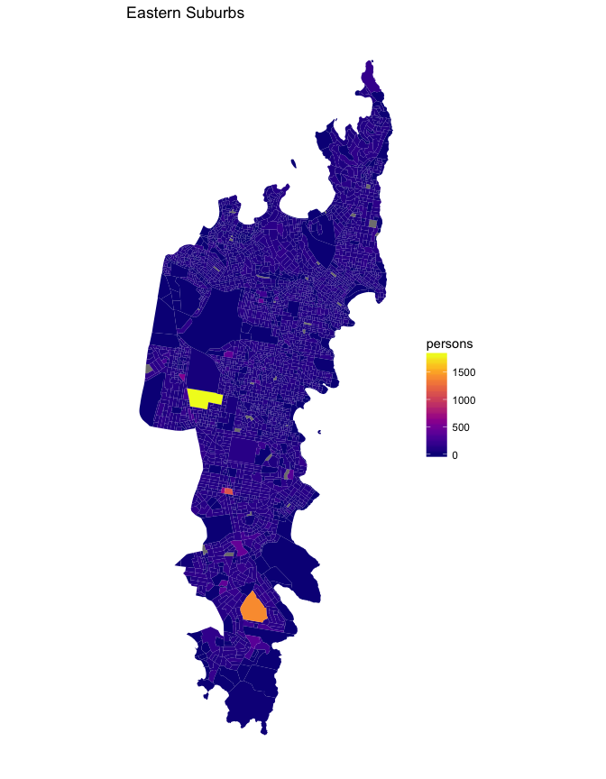

Where no-one lives in Sydney: a comparison of Hornsby and the Eastern Suburbs
================
Neil Saunders
2018-04-10 22:13:34

-   [Introduction](#introduction)
-   [Getting the data](#getting-the-data)
    -   [The Census data](#the-census-data)
    -   [The Map data](#the-map-data)
-   [Data processing](#data-processing)
-   [Visualization](#visualization)
    -   [Population - Eastern Suburbs](#population---eastern-suburbs)
    -   [Population - Hornsby](#population---hornsby)
    -   [Empty blocks - Eastern Suburbs](#empty-blocks---eastern-suburbs)
    -   [Empty blocks - Hornsby](#empty-blocks---hornsby)
-   [Summary](#summary)

Introduction
============

I like maps that show data - [for example this map](http://gothamist.com/2014/04/17/heres_a_map_of_the_places_in_the_us.php) of places in the United States where no-one lives. However, none of my work projects have required me to learn mapping skills in R.

So for fun, I decided to recreate the USA analysis using Australian census data for two statistical areas in Sydney: Hornsby, a low population density area where I currently live and the Eastern Suburbs, a high population density area where I lived previously.

I was guided by two resources: [plotting polygon shapefiles](https://github.com/hadley/ggplot2/wiki/plotting-polygon-shapefiles) and [Making Maps in R](http://www.kevjohnson.org/making-maps-in-r/).

Getting the data
================

The Census data
---------------

Census data was obtained from the Australian Bureau of Statistics. [The data source](http://www.abs.gov.au/AUSSTATS/abs@.nsf/DetailsPage/2074.02011?OpenDocument) is called *2074.0 - Census of Population and Housing: Mesh Block Counts, 2011* and can be downloaded from the website as a CSV file.

The Map data
------------

Map data were also obtained from the Australian Bureau of Statistics. [This source](http://www.abs.gov.au/AUSSTATS/abs@.nsf/DetailsPage/1270.0.55.001July%202011?OpenDocument) is called *1270.0.55.001 - Australian Statistical Geography Standard (ASGS): Volume 1 - Main Structure and Greater Capital City Statistical Areas, July 2011*. I downloaded the zip file *New South Wales Mesh Blocks ASGS Ed 2011 Digital Boundaries in ESRI Shapefile Format*, which unzips to 5 files: MB\_2011\_NSW.cpg, MB\_2011\_NSW.dbf, MB\_2011\_NSW.prj, MB\_2011\_NSW.shp and MB\_2011\_NSW.shx.

Data processing
===============

First, we load the required packages and read the census data into a data frame. Note that on Ubuntu-like systems, the *rgdal* package requires `sudo apt-get install libgdal-dev libproj-dev`.

Next, we read in the New South Wales shapefile to create an object of class *SpatialPolygonsDataFrame*. This stores the polygon data for drawing maps along with any other data that we want to use. Adding a key, *id*, helps us to join coordinates with other data in a later step.

    ## OGR data source with driver: ESRI Shapefile 
    ## Source: "/Users/neilsaunders/Dropbox/projects/github_projects/ABSData/census_mapping/data/shapefiles/asgs/2011", layer: "MB_2011_NSW"
    ## with 107325 features
    ## It has 16 fields

Exploring the object reveals that the areas we want to use are stored under the name *SA3\_NAME11*. Hornsby is one area; the Eastern Suburbs is split into North and South. Census Mesh Block IDs are stored under *MB\_CODE11*.

    ##  [1] "Albury"                         "Armidale"                      
    ##  [3] "Auburn"                         "Bankstown"                     
    ##  [5] "Bathurst"                       "Baulkham Hills"                
    ##  [7] "Blacktown"                      "Blacktown - North"             
    ##  [9] "Blue Mountains"                 "Blue Mountains - South"        
    ## [11] "Botany"                         "Bourke - Cobar - Coonamble"    
    ## [13] "Bringelly - Green Valley"       "Broken Hill and Far West"      
    ## [15] "Camden"                         "Campbelltown (NSW)"            
    ## [17] "Canada Bay"                     "Canterbury"                    
    ## [19] "Carlingford"                    "Chatswood - Lane Cove"         
    ## [21] "Clarence Valley"                "Coffs Harbour"                 
    ## [23] "Cronulla - Miranda - Caringbah" "Dapto - Port Kembla"           
    ## [25] "Dubbo"                          "Dural - Wisemans Ferry"        
    ## [27] "Eastern Suburbs - North"        "Eastern Suburbs - South"       
    ## [29] "Fairfield"                      "Gosford"                       
    ## [31] "Goulburn - Yass"                "Great Lakes"                   
    ## [33] "Griffith - Murrumbidgee (West)" "Hawkesbury"                    
    ## [35] "Hornsby"

We write a function to melt the data for each area into a data frame of points, join with the shapefile data, match to the census data and then add the population information.

Visualization
=============

Let's start by trying to convey an impression of population density.

Population - Eastern Suburbs
----------------------------

This area contains several blocks with a very high number of residents. Comparison with Sydney suburbs on a Google Map shows that these blocks include Matraville, Maroubra and the University of New South Wales campus.

Population - Hornsby
--------------------

The overall impression of Hornsby compared with the Eastern Suburbs is one of lower density with more, larger empty blocks. The southern end of the area contains a couple of high density blocks near the boundary of the suburbs Hornsby and Waitara.

Empty blocks - Eastern Suburbs
------------------------------

The United States map used green for empty blocks and white for blocks with residents. I think this is counter-intuitive and so have reversed the colour scheme.

I was initially surprised that there are any empty blocks in the Eastern Suburbs but of course, every area contains land that is not residential such as parks. Notable large uninhabited regions include the Centennial Parklands and Malabar Headland National Park.

Empty blocks - Hornsby
----------------------

Once again the overall impression is one of more, larger empty blocks. Many of these correspond to the extensive bushland of the Hornsby region, such as the Berowra Valley and Ku-ring-ai Chase National Parks and Muogamarra Nature Reserve.

Summary
=======

-   It's easy to generate high-quality, attractive and informative maps using R
-   There are undoubtedly faster, more elegant ways to do it than those used in this document; in particular, we have not yet looked at *geom\_map*
-   Do you like quiet, wide open spaces? Choose Hornsby Shire :)
