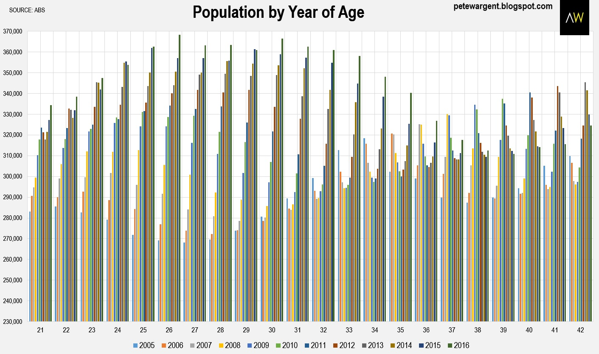
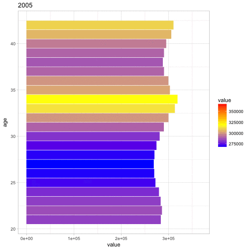

```{r setup, include=FALSE}
knitr::opts_chunk$set(echo = FALSE, warning = FALSE, message = FALSE)

library(dplyr)
library(tidyr)
library(readxl)
library(ggplot2)
library(gridExtra)
library(lubridate)
library(gganimate)

theme_set(theme_light())
```

# Introduction
“‘Demographic tsunami’ will keep Sydney, Melbourne property prices high” [screams the headline](http://www.smh.com.au/business/the-economy/demographic-tsunami-will-keep-sydney-melbourne-property-prices-high-20170629-gx1onj.html) in the Sydney Morning Herald (SMH).

    While the census showed Australia overall is aging, there’s been a noticeable lift in the number of people aged between 25 to 32.
    As the accompanying graph shows…
    


Whoa, that is one ugly chart. First thought: let’s not be too hard on Fairfax Media, they’ve sacked most of their real journalists and they took the chart from [someone else](http://petewargent.blogspot.com.au/2017/06/demographic-tsunami.html). Second thought: if you want to visualise change over time, time as an axis rather than a coloured bar is generally a good idea.

Can we do better?

First, grab the raw data: in this case, [a spreadsheet](http://www.abs.gov.au/AUSSTATS/abs@.nsf/DetailsPage/3101.0Dec%202016?OpenDocument) (Table 59) from the Australian Bureau of Statistics (ABS). It contains counts of males, females and persons from ages 0 - 100+ in one year increments, for the years 1971 - 2016.

For some reason, government departments like to make their data as wide as possible. In this case, 251 columns where 1 = the year, 2 - 102 are male ages, 103-202 female ages and 203 - 251 are persons (male + female) ages 0 - 47. Persons ages 48 - 100+ are in a second sheet in the same file...no, I don't know why either.

Fortunately, `readxl` takes care of all this, so all we need to do is give the columns some sensible names followed by the `tidyr` treatment.

```{r read-data}
auspop <- read_excel("../../scratch/3101059.xls",
sheet = "Data1", col_names = FALSE, col_types = c("date",
"numeric", "numeric", "numeric",
"numeric", "numeric", "numeric",
"numeric", "numeric", "numeric",
"numeric", "numeric", "numeric",
"numeric", "numeric", "numeric",
"numeric", "numeric", "numeric",
"numeric", "numeric", "numeric",
"numeric", "numeric", "numeric",
"numeric", "numeric", "numeric",
"numeric", "numeric", "numeric",
"numeric", "numeric", "numeric",
"numeric", "numeric", "numeric",
"numeric", "numeric", "numeric",
"numeric", "numeric", "numeric",
"numeric", "numeric", "numeric",
"numeric", "numeric", "numeric",
"numeric", "numeric", "numeric",
"numeric", "numeric", "numeric",
"numeric", "numeric", "numeric",
"numeric", "numeric", "numeric",
"numeric", "numeric", "numeric",
"numeric", "numeric", "numeric",
"numeric", "numeric", "numeric",
"numeric", "numeric", "numeric",
"numeric", "numeric", "numeric",
"numeric", "numeric", "numeric",
"numeric", "numeric", "numeric",
"numeric", "numeric", "numeric",
"numeric", "numeric", "numeric",
"numeric", "numeric", "numeric",
"numeric", "numeric", "numeric",
"numeric", "numeric", "numeric",
"numeric", "numeric", "numeric",
"numeric", "numeric", "numeric",
"numeric", "numeric", "numeric",
"numeric", "numeric", "numeric",
"numeric", "numeric", "numeric",
"numeric", "numeric", "numeric",
"numeric", "numeric", "numeric",
"numeric", "numeric", "numeric",
"numeric", "numeric", "numeric",
"numeric", "numeric", "numeric",
"numeric", "numeric", "numeric",
"numeric", "numeric", "numeric",
"numeric", "numeric", "numeric",
"numeric", "numeric", "numeric",
"numeric", "numeric", "numeric",
"numeric", "numeric", "numeric",
"numeric", "numeric", "numeric",
"numeric", "numeric", "numeric",
"numeric", "numeric", "numeric",
"numeric", "numeric", "numeric",
"numeric", "numeric", "numeric",
"numeric", "numeric", "numeric",
"numeric", "numeric", "numeric",
"numeric", "numeric", "numeric",
"numeric", "numeric", "numeric",
"numeric", "numeric", "numeric",
"numeric", "numeric", "numeric",
"numeric", "numeric", "numeric",
"numeric", "numeric", "numeric",
"numeric", "numeric", "numeric",
"numeric", "numeric", "numeric",
"numeric", "numeric", "numeric",
"numeric", "numeric", "numeric",
"numeric", "numeric", "numeric",
"numeric", "numeric", "numeric",
"numeric", "numeric", "numeric",
"numeric", "numeric", "numeric",
"numeric", "numeric", "numeric",
"numeric", "numeric", "numeric",
"numeric", "numeric", "numeric",
"numeric", "numeric", "numeric",
"numeric", "numeric", "numeric",
"numeric", "numeric", "numeric",
"numeric", "numeric", "numeric",
"numeric", "numeric", "numeric",
"numeric", "numeric", "numeric",
"numeric", "numeric", "numeric",
"numeric", "numeric", "numeric",
"numeric", "numeric", "numeric",
"numeric", "numeric", "numeric",
"numeric", "numeric", "numeric",
"numeric"), skip = 10)
```

# Make tidy
```{r tidy-data, echo=TRUE}
colnames(auspop) <- c("Date", paste0("M-", 0:100), paste0("F-", 0:100), paste0("P-", 0:47))

auspop %>% 
  gather(key, value, -Date) %>% 
  separate(key, into = c("gender", "age"), sep = "-") %>% 
  mutate(age = as.numeric(age), Year = year(Date))
```

# Ages 21-42 from 2005 - 2016
The original chart from the SMH focused on ages 21 - 42 and years 2005 - 2016, so we'll do the same. I thought it would be interesting to animate the changes in population by year. My first attempt posted to Twitter was incorrect, in that the numbers were summed year on year, so here's a better version. The cumulative colouring gets a bit weird when numbers decrease, but I think it works to some degree.

Indeed, there does seem to be a recent surge in the "25 - 32 bracket" if that's what we're calling it.

```{r animate-21-42}
p1 <- auspop %>% 
  gather(key, value, -Date) %>% 
  separate(key, into = c("gender", "age"), sep = "-") %>% 
  mutate(age = as.numeric(age), Year = year(Date)) %>% 
  filter(gender == "P", Year >= 2005, between(age, 21, 42)) %>% 
  ggplot(aes(age, value, frame = Year, cumulative = TRUE)) + 
    geom_col(aes(fill = value, color = value), position = "identity") + 
    scale_fill_gradientn(colors = c("blue", "yellow", "red")) + 
    scale_color_gradientn(colors = c("blue", "yellow", "red")) + 
    coord_flip()

gganimate(p1, ani.width = 500, ani.height = 500, filename = "../../output/tsunami.gif")
```



# Ages 25-32 as a proportion of 21-42
Things get less tsunami-like when we try to visualize age brackets as a proportion of all ages. The 25-32 band grows a little but - tsunami?

```{r plot-25-32-fraction}
auspop %>% 
  gather(key, value, -Date) %>% 
  separate(key, into = c("gender", "age"), sep = "-") %>% 
  mutate(age = as.numeric(age), Year = year(Date)) %>% 
  filter(gender == "P", Year >= 2005) %>% 
  group_by(Year) %>% 
  mutate(rank = cut(age, breaks = c(0, 25, 32, 100), include.lowest = TRUE, ordered_result = TRUE)) %>% 
  mutate(rank = factor(rank, levels = c("(32,100]", "(25,32]", "[0,25]"))) %>%
  filter(between(age, 21, 42)) %>%
  ggplot(aes(Year, value)) +
    geom_col(position = "fill", aes(fill = rank)) + 
    scale_fill_brewer(palette = "Spectral", name = "age range", labels = c("33-42", "25-32", "21-24")) +
    labs(y = "proportion", title = "Australia 25-32 year-olds 2005-2016", subtitle = "as proportion of 21-42")
```

When you put things out on Twitter, be sure that chart nerds will descent to join in the fun.

https://twitter.com/MattCowgill/status/881800327560708097

Matt rightly asks: what's the proportion of 25-32 year-olds anyway? We can reproduce his line charts like so. Now we see that 25-32 year-olds as a percentage of total population have increased recently after an all-time (since 1971) low and in fact, the rate of increase seems to have slowed. Tsunami?

# Ages 25-32 as a proportion of total
```{r plot-25-32-cowgill, fig.width=8}
p1 <- auspop %>% 
  gather(key, value, -Date) %>% 
  separate(key, into = c("gender", "age"), sep = "-") %>% 
  mutate(age = as.numeric(age), Year = year(Date)) %>% 
  filter(gender != "P") %>% 
  group_by(Year) %>% 
  summarise(f = sum(value[between(age, 25, 32)]), v = sum(value)) %>% 
  ggplot(aes(Year, f)) + 
    geom_line() +
    labs(x = "Year", y = "count (thousands)", title = "Australia 25-32 year-olds 1971-2016")

p2 <- auspop %>% 
  gather(key, value, -Date) %>% 
  separate(key, into = c("gender", "age"), sep = "-") %>% 
  mutate(age = as.numeric(age), Year = year(Date)) %>% 
  filter(gender != "P") %>% 
  group_by(Year) %>% 
  summarise(f = sum(value[between(age, 25, 32)]), v = sum(value)) %>% 
  ggplot(aes(Year, f/v)) + 
    geom_line() +
    labs(x = "Year", y = "proportion", title = "Australia 25-32 year-olds 1971-2016", subtitle = "as proportion of total population")

grid.arrange(p1, p2, ncol = 2)
```

# In conclusion

- colouring bars by year: wrong
- Excel: enough said
- tsunami: hardly

# Population pyramids
I've always liked [population pyramids](https://en.wikipedia.org/wiki/Population_pyramid), ever since I first learned about them in high school geography class. Here's my attempt to animate one. The trick is to subset the data by gender, then create two geoms and set the values for one subset to be negative (but not the labels). More commonly, ages are binned and proportions rather than counts may be used, but I did neither in this case.

I find it either mesmerising or too much, depending on my mood.

```{r pyramid}
mf1 <- auspop %>% 
  gather(key, value, -Date) %>% 
  separate(key, into = c("gender", "age"), sep = "-") %>% 
  mutate(age = as.numeric(age), Year = year(Date)) %>% 
  filter(gender != "P")

p1 <- ggplot() + 
        geom_col(data = subset(mf1, gender == "M"), aes(x = age, y = value, fill = gender, color = gender, frame = Year, cumulative = TRUE), position = "identity") + 
        geom_col(data = subset(mf1, gender == "F"), aes(x = age, y = -value, fill = gender, color = gender, frame = Year, cumulative = TRUE), position = "identity") + 
        coord_flip()  + 
        scale_fill_manual(values = c("darkorange", "skyblue3")) + 
        scale_color_manual(values = c("darkorange", "skyblue3")) + 
        labs(y = "count (thousands)", x = "age", title = "Australian population", subtitle = "1971 - 2016") + 
        scale_x_continuous(breaks = seq(0, 100, 10)) + 
        scale_y_continuous(labels = abs(seq(-200000, 200000, 50000)), breaks = seq(-200000, 200000, 50000))

gganimate(p1, ani.width = 500, ani.height = 500, filename = "../../output/pyramid.gif")
```


